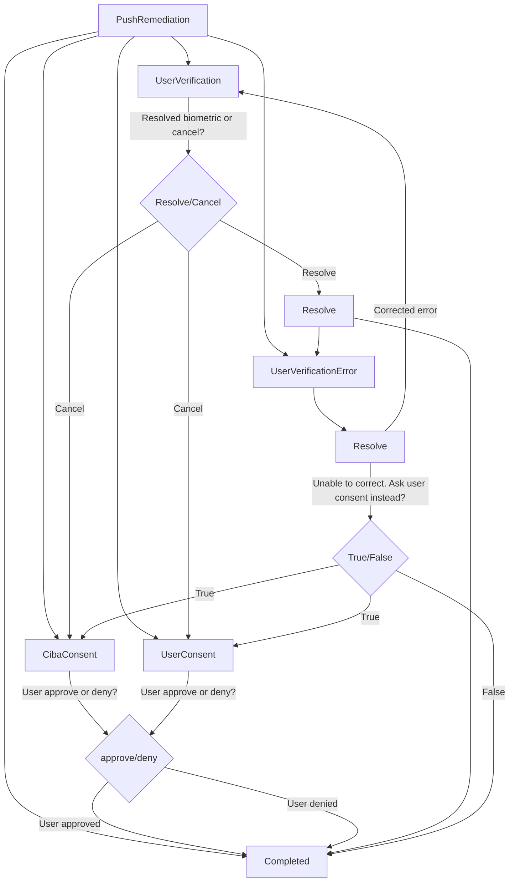

[][devforum]
[](https://opensource.org/licenses/Apache-2.0)

# Okta Devices SDK

This library is Okta's multi-factor push authentication service that provides a way for you to implement MFA in your Android application.

**Table of Contents**

- [Okta Devices SDK](#okta-devices-sdk)
    - [Release status](#release-status)
    - [Need help?](#need-help)
    - [Getting started](#getting-started)
    - [Installation](#Installation)
    - [Usage](#Usage)
        - [Creation](#Creation)
        - [Proguard](#Proguard)
        - [Enrollment](#Enrollment)
            - [Retrieve existing enrollments](#Retrieve-existing-enrollments)
            - [Update registration token](#Update-registration-token)
            - [Update user verification](#Update-user-verification)
            - [Delete enrollment](#Delete-enrollment)
            - [Delete enrollment from device](#Delete-enrollment-from-device)
        - [Verification](#Verification)
            - [Retrieve pending challenges](#Retrieve-pending-challenges)
            - [Resolve the challenge](#Resolve-the-challenge)
            - [Remediation steps](#remediation-steps)
                - [UserConsent](#UserConsent)
                - [UserVerification](#UserVerification)
                - [UserVerificationError](#UserVerificationError)
                - [Completed](#Completed)

## Release status

This library uses semantic versioning and follows Okta's [Library Version Policy][okta-library-versioning].

| Version | Status                             |
| ------- | ---------------------------------- |
| 0.0.1   | ⚠ Beta                             |

⚠ Beta version is currently in development and isn't ready for production use

The latest release can always be found on the [releases page][github-releases].

## Need help?

If you run into problems using the SDK, you can:

* Ask questions on the [Okta Developer Forums][devforum]
* Post [issues][github-issues] here on GitHub (for code errors)

## Getting started

To use this SDK you will need to create a custom authenticator on your Okta service and provide your push notification credentials.  
See [Custom authenticator integration guide] for more details.

- **Kotlin Coroutines**: The following sample code assumes that suspend functions are called in a coroutine scope. See [Kotlin Coroutines] for more information.

See the [Push Sample App] for a complete implementation.

### Installation

Add the Okta Devices SDK dependency to your build.gradle file:

```kotlin
implementation("com.okta.devices:devices-push:0.0.1")
```

## Usage

A complete integration requires your app to implement the following:

- **Creation:** Create the SDK object to work with your Okta authenticator configuration.
- **Enrollment:** Register a device and optional biometrics with an account for use with push MFA.
- **Verification:** Resolve an MFA challenge step for a sign-in attempt against an enrolled account, prompting the user to approve or reject it (with optional biometrics).
- **Update:** Refresh the FCM device registration token, remediate changed biometrics, deregister the account on the device.

### Creation

Create the SDK object to work with your Okta authenticator configuration. Use the PushAuthenticatorBuilder to create an authenticator with your application configuration:

```kotlin
val authenticator: PushAuthenticator = PushAuthenticatorBuilder.create(
    ApplicationConfig(context, appName = "MyApp", appVersion = BuildConfig.VERSION_NAME)
) {
    passphrase = encryptedSharedPreference.getString(passphraseKey, null)?.toByteArray() // Secret must be stored securely 
}.getOrThrow()
```

If a passphrase isn't provided, then the Devices SDK data will not be encrypted. It is up to you to secure the passphrase. Please store your passphrase in a secure way: in the above example and sample
app we use Android's [EncryptedSharedPreferences](https://developer.android.com/topic/security/data#kotlin) class.


### Proguard

If encryption is enabled, add the following to your proguard configuration file:

```text
-keep,includedescriptorclasses class net.sqlcipher.** { *; }
-keep,includedescriptorclasses interface net.sqlcipher.** { *; }
```

### Enrollment

Once an authenticator and OIDC application has been created, you will also need a Firebase device registration token. After we have met all the requirements, you can start enrolling the user by doing
the following:

```kotlin
val authConfig = DeviceAuthenticatorConfig(URL(orgUrl), "oidcClientId")
val result = authenticator.enroll(AuthToken.Bearer("accessToken"), authConfig, EnrollmentParameters.Push(FcmToken("registrationToken"), enableUserVerification = false, enableCiba = false))
if (result.isSuccess) {
    val pushEnrollment: PushEnrollment = result.getOrThrow()
}
```

#### Retrieve existing enrollments

In order to retrieve information about existing enrollments, use `allEnrollments()`. This can be used to display attributes for a list of accounts or find a specific account in order to update or
delete it.

```kotlin
val enrollments: List<PushEnrollment> = authenticator.allEnrollments().getOrThrow()
```

#### Update registration token

Whenever the FCM SDK sends your application a new token with FirebaseMessagingService.onNewToken, you can update existing enrollments with the new token by doing the following:

```kotlin
val enrollments: List<PushEnrollment> = authenticator.allEnrollments().getOrThrow()

// Find the enrollment associated with the current user
enrollments.find { it.user().name == "myUser" }?.let { pushEnrollment ->
    pushEnrollment.updateRegistrationToken(AuthToken.Bearer("accessToken"), FcmToken("newToken"))
        .onSuccess { println("success") }
        .onFailure { println("failure") }
}
```

#### Update user verification

User verification is for checking that a user is the one claimed, this can be achieved by asking the user for biometrics. You can enable or disable user verification by doing the following:

```kotlin
val enrollments: List<PushEnrollment> = authenticator.allEnrollments().getOrThrow()

// Find the enrollment associated with the current user
enrollments.find { it.user().name == "myUser" }?.let { pushEnrollment ->
    pushEnrollment.setUserVerification(AuthToken.Bearer("accessToken"), true)
        .onSuccess { println("success") }
        .onFailure { println("failure") }
}
```

#### Update CIBA setting

Enable CIBA setting will allow the device to verify CIBA request. You can enable or disable CIBA by doing the following:

```kotlin
val enrollments: List<PushEnrollment> = authenticator.allEnrollments().getOrThrow()

// Find the enrollment associated with the current user
enrollments.find { it.user().name == "myUser" }?.let { pushEnrollment ->
    pushEnrollment.enableCibaTransaction(AuthToken.Bearer("accessToken"), true)
        .onSuccess { println("success") }
        .onFailure { println("failure") }
}
```

### Delete enrollment

Deleting an enrollment will unenroll push verification. This will result in the SDK deleting enrollment from the device when a successful response is received from the Okta server.

```kotlin
val enrollments: List<PushEnrollment> = authenticator.allEnrollments().getOrThrow()

// Find the enrollment associated with the current user and delete it
enrollments.find { it.user().name == "myUser" }?.let { pushEnrollment ->
    authenticator.delete(AuthToken.Bearer("accessToken"), pushEnrollment)
        .onSuccess { println("success") }
        .onFailure { println("failure") }
}
```

### Delete enrollment from device

The difference between calling `deleteFromDevice` and `delete` is that `deleteFromDevice` does not make a server call to unenroll push verification. Therefore it does not require any authorization.
**Use this with caution** as the user will be unable to meet MFA requirements for any sign-in attempt.

```kotlin
val enrollments: List<PushEnrollment> = authenticator.allEnrollments().getOrThrow()

// Find the enrollment associated with the current user
enrollments.find { it.user().name == "myUser" }?.let { pushEnrollment ->
    pushEnrollment.deleteFromDevice()
        .onSuccess { println("success") }
        .onFailure { println("failure") }
}
```

### Verification

When a user attempts to sign in to the enrolled account (e.g. via an app or a web browser), Okta's backend will create a push challenge and send this challenge to enrolled devices via your push
provider.

#### Retrieve pending challenges

Sometimes Firebase messaging service fails to deliver a notification to the user, we can check the server to see if we have any pending challenges by doing the following:

```kotlin
val enrollments: List<PushEnrollment> = authenticator.allEnrollments().getOrThrow()

// Find the enrollment associated with the current user
enrollments.find { it.user().name == "myUser" }?.let { pushEnrollment ->
    pushEnrollment.retrievePushChallenges(AuthToken.Bearer("accessToken"))
        .onSuccess { println("success") }
        .onFailure { println("failure") }
}
```

### Resolve the challenge

Once you have received a challenge via one of the channels above, your app should `resolve` them in order to proceed with login. The SDK may request remediation steps to resolve the challenge.
Remediation steps are subclasses of the sealed class `PushRemediation`, which allows us to use the `when` statement to handle the remediation steps:

```kotlin

val fcmRemoteMessage = "PushChallengeString" // fcm challenge
val scope = CoroutineScope(Job() + Dispatchers.IO)

authenticator.parseChallenge(fcmRemoteMessage)
    .onSuccess { challenge ->
        challenge.resolve().onSuccess { remediation ->
            scope.launch {
                remediate(remediation) // call method to handle remediation
            }
        }.onFailure { println("failure") }
    }.onFailure { println("failure") }

private suspend fun remediate(remediation: PushRemediation) = runCatching {
    when (remediation) {
        is CibaConsent -> handleCibaConsent(remediation) //See section on CibaConsent
        is UserConsent -> handleUserConsent(remediation) // See section on UserConsent
        is UserVerification -> handleUserVerification(remediation) // See section on UserVerification
        is UserVerificationError -> handleUserVerificationError(remediation) // See section on UserVerificationError
        is Completed -> handleCompleted(remediation) // See section on Completed
    }
}.getOrElse { onError(it) }

private fun onError(throwable: Throwable) {
    // handle error
}
```

### Remediation steps



For remediation steps that requires user confirmation, it is important to display the information from the `PushChallenge` property in `PushRemediation`. All of the challenge steps can call `deny()`
to reject the challenge, except the completed step.

#### UserConsent

Use to handle login request, display the challenge information and request the user to either accept or deny:

```kotlin
private suspend fun handleUserConsent(userConsent: UserConsent) = runCatching {
    // Show the following information in a UX dialog and ask the user to accept or deny.
    // Application name: ${userConsent?.challenge?.appInstanceName}")
    // Location of sign in attempt: {userConsent?.challenge?.clientLocation}")
    // OS used to sign in: ${userConsent?.challenge?.clientOs}")
    // URL that initiated the sign in: ${userConsent?.challenge?.originUrl}
    // Time of sign in attempt: ${userConsent?.challenge?.transactionTime}

    // Call either userConsent.accept() or userConsent.deny() depending on user interaction

    // if user accept the challenge
    userConsent.accept()
        .onSuccess { remediate(it) }
        .onFailure { onError(it) }
    // if user denied the challenge
    userConsent.deny()
        .onSuccess { remediate(it) }
        .onFailure { onError(it) }
}.getOrElse { onError(it) }
```

Based on the diagram from [Remediation steps](#Remediation steps), the next possible step is [Completed](#Completed). See [PushMessagingService] for a complete example.

#### CibaConsent

Similar to UserConsent,use to handle CIBA request display the binding message and request the user to either accept or deny:

```kotlin
private suspend fun handleCibaConsent(cibaConsent: CibaConsent) = runCatching {
    // Show the following information in a UX dialog and ask the user to accept or deny.
    // Binding message: ${cibaConsent?.bindingMessage}")
    // Application name: ${userConsent?.challenge?.appInstanceName}")
    // Location of sign in attempt: {userConsent?.challenge?.clientLocation}")
    // OS used to sign in: ${userConsent?.challenge?.clientOs}")
    // URL that initiated the sign in: ${userConsent?.challenge?.originUrl}
    // Time of sign in attempt: ${userConsent?.challenge?.transactionTime}

    // Call either cibaConsent.accept() or cibaConsent.deny() depending on user interaction

    // if user accept the challenge
    cibaConsent.accept()
        .onSuccess { remediate(it) }
        .onFailure { onError(it) }
    // if user denied the challenge
    cibaConsent.deny()
        .onSuccess { remediate(it) }
        .onFailure { onError(it) }
}.getOrElse { onError(it) }
```

Based on the diagram from [Remediation steps](#Remediation steps), the next possible step is [Completed](#Completed). See [PushMessagingService] for a complete example.

#### UserVerification

Display the challenge information and notify user that a biometric verification is required to proceed:

```kotlin
private suspend fun handleUserVerification(userVerification: UserVerification) = runCatching {
    // Similar to UserConsent, show all the challenge information from userVerification.challenge
    // You can either cancel the UserVerification or resolve with a authenticationResult from BiometricPrompt library

    // If user provided biometric verification
    userVerification.resolve(authenticationResult)
        .onSuccess { remediate(it) }
        .onFailure { onError(it) }
    // If user cancel the biometric prompt
    userVerification.cancel()
        .onSuccess { remediate(it) }
        .onFailure { onError(it) }
}.getOrElse { onError(it) }
```

From the diagram [Remediation steps](#Remediation-steps), the next possible steps are [UserConsent](#UserConsent), [UserVerificationError](#UserVerificationError) and [Completed](#Completed)

#### UserVerificationError

UserVerificationError can happen if the biometric key is invalid. This can happen if the user removes the pin or add a new fingerprint:

```kotlin
private suspend fun handleUserVerificationError(userVerificationError: UserVerificationError) = runCatching {
    // Inspect userVerificationError.securityError property to determine the correct action.
    // If the error is UserVerificationFailed, this is caused by the user failing the biometric challenge.
    // If the error is UserVerificationRequired, this is caused by missing biometric key. To fix this, you can ask
    // the user to enroll with user verification. Once you are confident the user has corrected the issue, try again by calling resolve.

    userVerificationError.resolve()
        .onSuccess { remediate(it) }
        .onFailure { onError(it) }
}.getOrElse { onError(it) }
```

From the diagram in [Remediation steps](#Remediation-steps), the next possible steps are [UserConsent](#UserConsent), [UserVerification](#UserVerification) and [Completed](#Completed)

#### Completed

The complete step contains information about a transaction that was completed successfully by the client. It does not mean that the user has successfully signed in.

```kotlin
private suspend fun handleCompleted(completed: Completed) {
    // print the completed state. 
    println("If user verification was used ${completed.state.userVerificationUsed}")
    println("Did user accept this challenge ${competed.state.accepted}")
    println("Exceptions encountered. ${competed.state.throwable}")
}
```

## Contributing

We are happy to accept contributions and PRs! Please see the [contribution guide](CONTRIBUTING.md) to understand how to structure a contribution.

[Push Sample App]: https://github.com/okta/okta-devices-kotlin/tree/master/push-sample-app

[devforum]: https://devforum.okta.com/

[lang-landing]: https://developer.okta.com/code/android/#android-libraries

[github-releases]: https://github.com/okta/okta-devices-kotlin/releases

[github-issues]: https://github.com/okta/okta-devices-kotlin/issues

[Rate Limiting at Okta]: https://developer.okta.com/docs/api/getting_started/rate-limits

[okta-library-versioning]: https://developer.okta.com/code/library-versions

[Kotlin coroutines]: https://kotlinlang.org/docs/coroutines-overview.html

[PushMessagingService]: https://github.com/okta/okta-devices-kotlin/blob/master/push-sample-app/src/main/java/example/okta/android/sample/service/PushMessagingService.kt

[Custom authenticator integration guide]: https://developer.okta.com/docs/guides/authenticators-custom-authenticator/android/main/